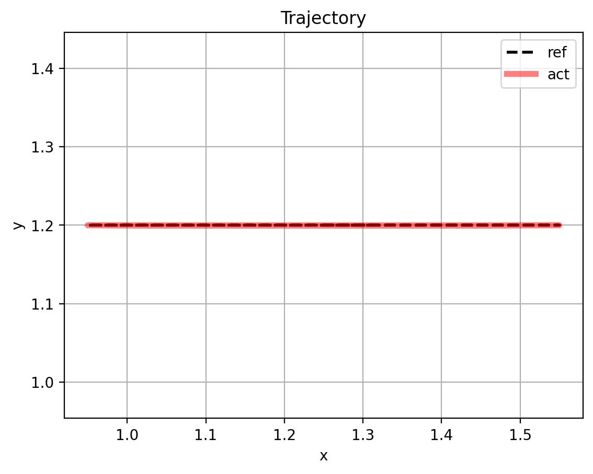
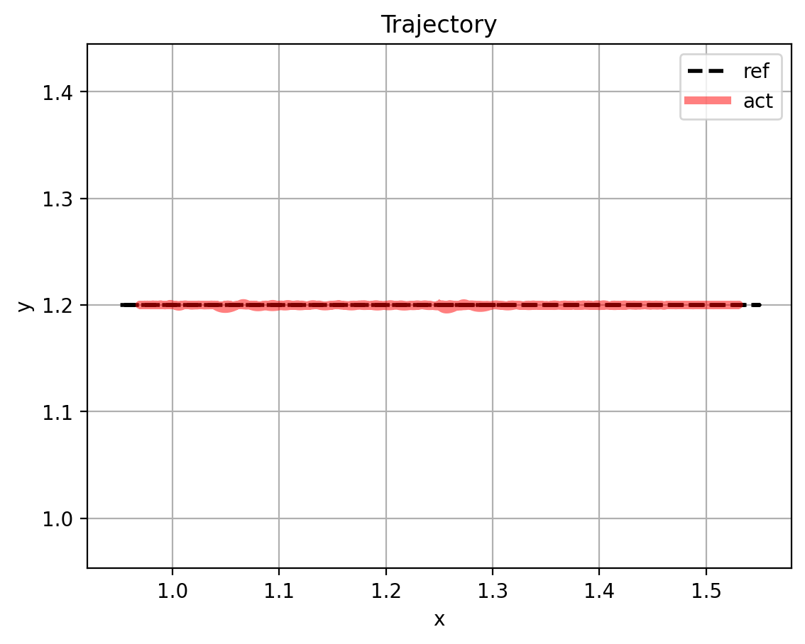

# Kinematics and Controls

This project is a portfolio-style MuJoCo workspace for UR5e kinematics and planar 3R control. It implements custom forward kinematics, numerical inverse kinematics, and task-space control, then validates each piece against simulation and saves plots/videos for inspection.

## Tech Stack

- MuJoCo for simulation and scene visualization
- NumPy for matrix and vector math
- SciPy `fsolve` for numerical inverse kinematics
- Matplotlib for trajectory and time-history plots
- Custom FK, IK, Jacobian, and inverse-dynamics code in Python

## Project Structure

- `src/Kinematics/Ur5e_Fwd_Kinematics/` contains the UR5e FK model and live FK comparison viewer
- `src/Kinematics/ur5_inverse_kinematics/` contains the UR5e IK solver and circle-tracking demo
- `src/Kinematics/planar_3R_hybrid_force/` contains planar 3R impedance and force-position control demos
- `src/Models/universal_robots_ur5e/` contains the UR5e MuJoCo XML model and assets

## Forward Kinematics

The UR5e FK chain is implemented in `src/Kinematics/Ur5e_Fwd_Kinematics/forward_kinematics.py` as a serial chain built from the robot description in `robot_data.py`.

For each joint $i$, the link transform is formed from the stored body quaternion and the joint rotation $R(q_i)$, then accumulated through the chain:

$$
H_{0}^{EE}(q) = H_{0}^{base}\prod_{i=1}^{6} H_i(q_i)\,H_{EE}
$$

The end-effector pose is the last link transform plus the local site offset from the MuJoCo `attachment_site`.

### FK assumptions

- The UR5e base quaternion and EE site quaternion match the MuJoCo XML model
- The joint order in Python matches the UR5e XML chain
- The robot is modeled as six revolute joints in a serial chain

### FK validation

- The live FK viewer lets me change joint values and compare the solved EE pose with the MuJoCo EE
- The comparison window plots MuJoCo EE and FK EE together and shows the gap line between them
- Home-pose validation against the MuJoCo `attachment_site` gave zero position error

```text
pos_err_m=0.000000
```

## Inverse Kinematics

The IK solver in `src/Kinematics/ur5_inverse_kinematics/inverse_kinematics.py` is a numerical root-finding method built on top of the FK model.

It takes a target pose $X_{ref} = [x, y, z, \phi, \theta, \psi]$, converts the orientation to a rotation matrix, runs FK on the current joint guess, and returns a residual vector to `scipy.optimize.fsolve`.

The residual used in the demo is:

$$
e(q) = [x-x_{ref},\; y-y_{ref},\; z-z_{ref},\; (RR_{ref}^T)_{11}-1,\; (RR_{ref}^T)_{22}-1,\; (RR_{ref}^T)_{33}-1]
$$

### IK assumptions

- The solver is local and depends on a good initial guess
- The target orientation is supplied as Euler angles in the demo and converted internally
- The circle demo tracks a planar $x$-$y$ circle with constant $z$ and constant orientation

### IK validation

- The circle demo compares the live MuJoCo EE position with the requested reference pose during the run
- The saved trajectory plot shows the reference path and achieved path together
- A direct terminal check on the corrected model showed zero position error for the home pose and the circle reference solve

```text
pos_err_m=0.000000
ik_pos_err_m=0.000000
```

## Planar 3R Controls

The planar 3R demos in `src/planar_3R_hybrid_force/` use task-space control with reference generation, inverse dynamics, and Jacobian-based feedback.

### Impedance control

The controller follows the standard structure:

$$
τ = M(q)\ddot q_d + C(q,\dot q)\dot q + G(q) + J(q)^T\big(K_p e + K_v \dot e\big)
$$

where the feedforward terms are computed with the Python dynamics model (`TMT` and `RNEA`) and the feedback term uses the end-effector Jacobian.

### Force-position control

The force-position demo keeps the same task-space tracking structure but adds a force component in the task direction while stabilizing the remaining components.

### Control assumptions

- The planar 3R robot is treated as a task-space system with $x$, $y$, and $\theta$
- The controller uses the current joint state and Jacobian from the model
- Reference trajectories are generated inside the script and then tracked in MuJoCo

### Control validation

- The saved trajectory plots compare reference and actual motion
- The time-history plots show the joint response and control signal response
- The MP4 files capture the motion while the controller runs

## Results

### UR5e FK


[Forward video](runs/kinematics/ur5e_forward/Video%20Project%209.mp4)

### UR5e IK


[Inverse video](runs/kinematics/ur5e_inverse/Video%20Project%208.mp4)

### Planar 3R impedance control



[Impedance video](runs/control/planar3r_impedance/20260627-1359-57.4802634.mp4)

Saved impedance plots:

- [Joint positions](runs/control/planar3r_impedance/impedance_q_vs_time.png)
- [Joint velocities / commands](runs/control/planar3r_impedance/impedance_u_vs_time.png)

### Planar 3R force-position control



[Force-position video](runs/control/planar3r_force/20260627-1356-34.0636843.mp4)

Saved force-position plots:

- [Joint positions](runs/control/planar3r_force/force_position_q_vs_time.png)
- [Joint velocities / commands](runs/control/planar3r_force/force_position_u_vs_time.png)

## Run It

```bash
cd /home/shubham-0802/mujoco-dev
source mujoco-env/bin/activate
```

```bash
python -u src/Kinematics/Ur5e_Fwd_Kinematics/mj_forward_kinematics_ur5.py
python -u src/Kinematics/ur5_inverse_kinematics/mj_inverse_kinematcs_circle.py
python -u src/planar_3R_hybrid_force/mj_traj_impedance.py
python -u src/planar_3R_hybrid_force/mj_traj_hybrid_force_position.py
```

## Summary

This repository demonstrates how the same robot geometry can be used consistently across:

- forward kinematics
- numerical inverse kinematics
- MuJoCo validation
- task-space impedance control
- task-space force-position control

The saved plots and videos document the validation and control results for portfolio use.