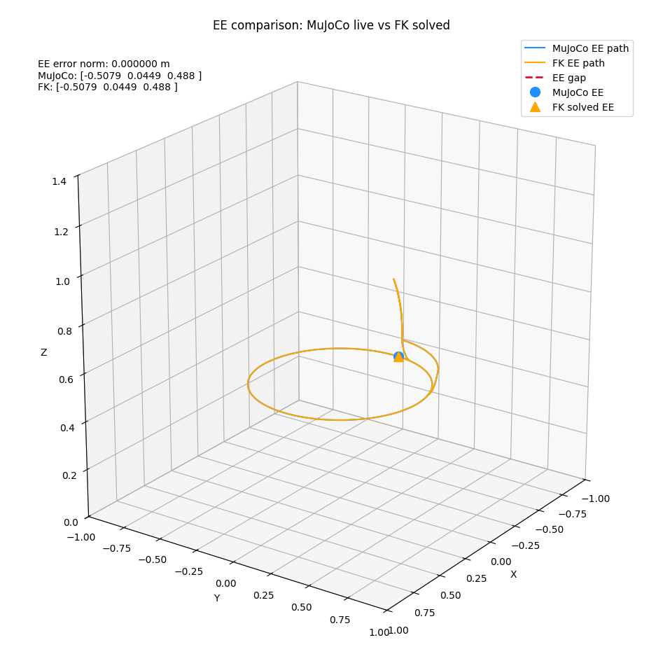
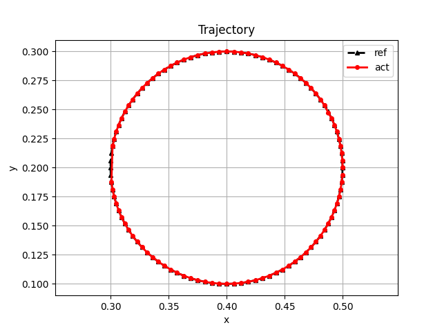

# Kinematics and Controls

This repository contains UR5e forward-kinematics and inverse-kinematics experiments built on top of MuJoCo, plus a few planar 3R control demos. The main goal so far has been to validate the UR5e FK/IK chain against the actual MuJoCo model, then record the motion and compare the solved end-effector pose with the simulated one.

## What is in the repo

- `src/Kinematics/Ur5e_Fwd_Kinematics/` contains the UR5e forward-kinematics model, live FK visualizers, and the MuJoCo-based UR5e comparison viewer.
- `src/Kinematics/ur5_inverse_kinematics/` contains the UR5e inverse-kinematics solver and the circle-tracking demo.
- `src/Kinematics/planar_3R_hybrid_force/` contains planar 3R control experiments.
- `src/Models/universal_robots_ur5e/` contains the UR5e MuJoCo XML model and assets.

## What has been completed so far

- The UR5e FK chain is implemented in Python and compared against the MuJoCo `attachment_site` end-effector.
- The FK data was aligned with the MuJoCo frame conventions by correcting the UR5e base and EE local quaternions.
- The inverse-kinematics code now uses the same corrected robot data, so FK and IK are working from the same geometry.
- The live inverse-kinematics circle demo now plots the reference and actual trajectories while the robot is moving.
- The UR5e MuJoCo viewer reports the live FK-vs-simulation EE gap during the run.

## Validation status

A direct terminal check on the corrected UR5e model showed that the FK end-effector position matches the MuJoCo `attachment_site` at the home keyframe:

```text
pos_err_m=0.000000
```

The inverse-kinematics solve against the circle-demo reference pose also converged back to the requested end-effector position with zero terminal position error in the direct check:

```text
ik_pos_err_m=0.000000
```

Those are the current representative accuracy checks for the corrected FK and IK models. The inverse-kinematics circle script also prints the live MuJoCo EE position and the requested reference position during the run so you can inspect tracking quality frame by frame.

## Saved outputs

### Forward kinematics



[Forward video](runs/kinematics/ur5e_forward/Video%20Project%209.mp4)

### Inverse kinematics



[Inverse video](runs/kinematics/ur5e_inverse/Video%20Project%208.mp4)

## How to run

Activate the virtual environment from the repository root:

```bash
cd /home/shubham-0802/mujoco-dev
source mujoco-env/bin/activate
```

Run the main UR5e FK viewer:

```bash
python -u src/Kinematics/Ur5e_Fwd_Kinematics/mj_forward_kinematics_ur5.py
```

Run the UR5e inverse-kinematics circle demo:

```bash
python -u src/Kinematics/ur5_inverse_kinematics/mj_inverse_kinematcs_circle.py
```

Run the standalone live FK slider viewer:

```bash
python -u src/Kinematics/Ur5e_Fwd_Kinematics/live_fk_slider.py --record-path runs/kinematics/ur5e_forward/live_fk.mp4
```

## Notes

- The live FK comparison window shows MuJoCo EE and solved FK EE at the same time, with a visible gap line between them.
- The inverse-kinematics circle demo now updates the trajectory plot while the robot moves, instead of waiting until the end of the simulation.
- The repo currently focuses on validating kinematics and recording the results; control demos are included as additional experiments.